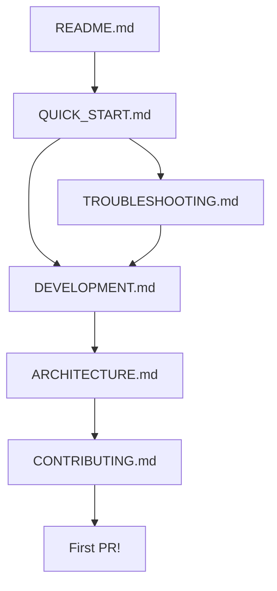
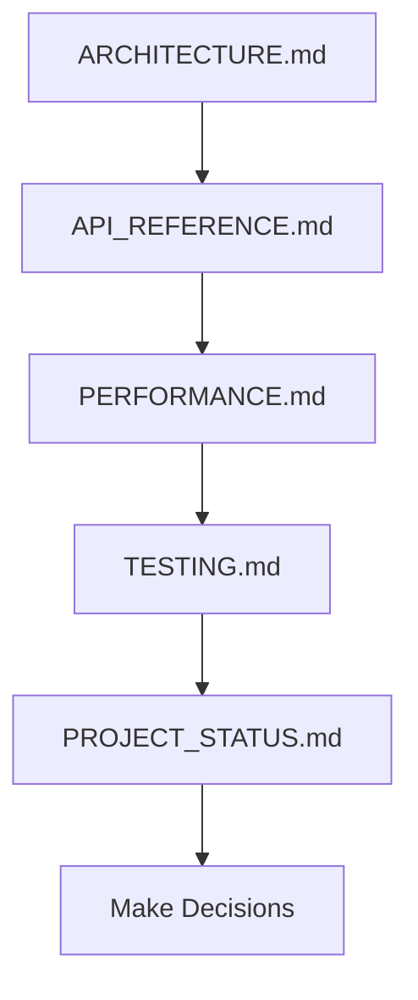
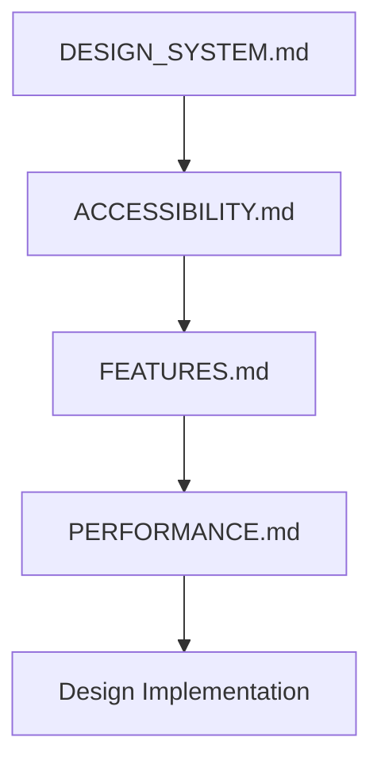

# Documentation Map

> Visual guide to Lumora's documentation structure.

```
┌─────────────────────────────────────────────────────────────┐
│                       🏠 START HERE                          │
│                                                              │
│  📘 README.md ─────────────────── Project Overview          │
│     │                                                        │
│     ├─► Quick Start Guide ────── Get running in 5 minutes   │
│     ├─► Features ─────────────── What the app does          │
│     ├─► Architecture ─────────── How it's built             │
│     └─► Documentation Index ──── Find anything              │
└─────────────────────────────────────────────────────────────┘

┌─────────────────────────────────────────────────────────────┐
│                   🚀 GETTING STARTED                         │
│                                                              │
│  1. QUICK_START.md ───────────── 5-minute setup             │
│  2. TROUBLESHOOTING.md ───────── Common issues              │
│  3. DEVELOPMENT.md ───────────── Dev workflow               │
└─────────────────────────────────────────────────────────────┘

┌─────────────────────────────────────────────────────────────┐
│                    💻 DEVELOPMENT                            │
│                                                              │
│  CONTRIBUTING.md ─────────────── How to contribute          │
│  DEVELOPMENT.md ──────────────── Complete dev guide         │
│  ARCHITECTURE.md ─────────────── System design              │
│  TESTING.md ──────────────────── Test guidelines            │
│  CHANGELOG_GUIDE.md ──────────── Doc changes                │
└─────────────────────────────────────────────────────────────┘

┌─────────────────────────────────────────────────────────────┐
│                     📚 REFERENCE                             │
│                                                              │
│  API_REFERENCE.md ────────────── Hooks, services, types     │
│  FEATURES.md ─────────────────── Feature catalog            │
│  SEARCH.md ───────────────────── Search docs                │
│  FAVORITES_FEATURE.md ────────── Favorites impl             │
└─────────────────────────────────────────────────────────────┘

┌─────────────────────────────────────────────────────────────┐
│                      🎨 DESIGN                               │
│                                                              │
│  DESIGN_SYSTEM.md ────────────── Tokens & patterns          │
│  ACCESSIBILITY.md ────────────── A11y guidelines            │
│  PERFORMANCE.md ──────────────── Optimization               │
│  BUNDLE_SIZE.md ──────────────── Bundle analysis            │
└─────────────────────────────────────────────────────────────┘

┌─────────────────────────────────────────────────────────────┐
│                    ⚙️ OPERATIONS                             │
│                                                              │
│  DEPLOYMENT.md ───────────────── Build & deploy             │
│  PROJECT_STATUS.md ───────────── Current state              │
│  ROADMAP.md ──────────────────── Future plans               │
│  SECURITY.md ─────────────────── Security policy            │
└─────────────────────────────────────────────────────────────┘

┌─────────────────────────────────────────────────────────────┐
│                    🗺️ NAVIGATION                             │
│                                                              │
│  INDEX.md ────────────────────── Doc index & search         │
│  DOCUMENTATION_SUMMARY.md ────── Status & coverage          │
└─────────────────────────────────────────────────────────────┘
```

## 🎯 By Task

### "I want to set up the project"

```
START → QUICK_START.md → (issues?) → TROUBLESHOOTING.md
```

### "I want to contribute"

```
START → README.md → CONTRIBUTING.md → DEVELOPMENT.md → ARCHITECTURE.md
```

### "I want to understand a feature"

```
START → FEATURES.md → (specific) → SEARCH.md or FAVORITES_FEATURE.md
```

### "I want to use an API"

```
START → API_REFERENCE.md → (related) → ARCHITECTURE.md
```

### "I want to design UI"

```
START → DESIGN_SYSTEM.md → ACCESSIBILITY.md → PERFORMANCE.md
```

### "I want to optimize performance"

```
START → PERFORMANCE.md → BUNDLE_SIZE.md → API_REFERENCE.md
```

### "I want to deploy"

```
START → DEPLOYMENT.md → PROJECT_STATUS.md → SECURITY.md
```

## 📊 By Role

### New Contributor Flow



### Maintainer Flow



### Designer Flow



## 🔗 Document Relationships

### Core Triad

```
        ARCHITECTURE.md
              ▲
             / \
            /   \
           /     \
          /       \
         v         v
API_REFERENCE.md  TESTING.md
```

### Design Triad

```
     DESIGN_SYSTEM.md
              ▲
             / \
            /   \
           /     \
          /       \
         v         v
ACCESSIBILITY.md  PERFORMANCE.md
```

### Getting Started Chain

```
QUICK_START.md → DEVELOPMENT.md → CONTRIBUTING.md
       ↓
TROUBLESHOOTING.md
```

## 📏 Document Lengths

| Document | Lines | Reading Time |
|----------|-------|--------------|
| API_REFERENCE.md | 1,200 | 30 min |
| ARCHITECTURE.md | 800 | 20 min |
| PERFORMANCE.md | 900 | 22 min |
| DESIGN_SYSTEM.md | 1,000 | 25 min |
| ACCESSIBILITY.md | 800 | 20 min |
| DEVELOPMENT.md | 700 | 17 min |
| FEATURES.md | 800 | 20 min |
| TESTING.md | 400 | 10 min |
| CONTRIBUTING.md | 300 | 7 min |
| QUICK_START.md | 250 | 6 min |
| Others | 100-300 | 2-7 min |

## 🎓 Learning Paths

### Path 1: Quick Start (30 minutes)

1. README.md (5 min)
2. QUICK_START.md (6 min)
3. Run the app (5 min)
4. Explore features (10 min)
5. Read FEATURES.md (5 min)

### Path 2: Contributor (2 hours)

1. README.md (5 min)
2. QUICK_START.md (6 min)
3. DEVELOPMENT.md (17 min)
4. ARCHITECTURE.md (20 min)
5. API_REFERENCE.md (30 min)
6. TESTING.md (10 min)
7. CONTRIBUTING.md (7 min)
8. Practice (30 min)

### Path 3: Maintainer (4 hours)

1. Full Contributor Path (2 hours)
2. PERFORMANCE.md (22 min)
3. BUNDLE_SIZE.md (10 min)
4. DEPLOYMENT.md (10 min)
5. PROJECT_STATUS.md (5 min)
6. ROADMAP.md (5 min)
7. SECURITY.md (5 min)
8. Deep code exploration (2 hours)

### Path 4: Designer (1.5 hours)

1. README.md (5 min)
2. FEATURES.md (20 min)
3. DESIGN_SYSTEM.md (25 min)
4. ACCESSIBILITY.md (20 min)
5. PERFORMANCE.md (15 min)
6. Practice (30 min)

## 🔍 Search Keywords

Use these to find relevant docs:

| Topic | Documents |
|-------|-----------|
| **Setup** | QUICK_START, TROUBLESHOOTING |
| **Hooks** | API_REFERENCE, ARCHITECTURE |
| **Testing** | TESTING, CONTRIBUTING |
| **Styling** | DESIGN_SYSTEM, ACCESSIBILITY |
| **Performance** | PERFORMANCE, BUNDLE_SIZE |
| **Features** | FEATURES, SEARCH, FAVORITES |
| **Contributing** | CONTRIBUTING, DEVELOPMENT |
| **Deployment** | DEPLOYMENT, PROJECT_STATUS |

## 📱 Mobile-Friendly Docs

All documentation is:
- ✅ Markdown formatted
- ✅ No fixed widths
- ✅ Scrollable tables
- ✅ Clear headings
- ✅ Short paragraphs
- ✅ Readable on GitHub mobile

## 🆘 Help & Support

Can't find what you need?

1. Check [INDEX.md](./INDEX.md) for navigation
2. Search in [GitHub](https://github.com/JahanzaibJameel/Lumora-photogallery-App)
3. Check [Issues](https://github.com/JahanzaibJameel/Lumora-photogallery-App/issues)
4. Ask in [Discussions](https://github.com/JahanzaibJameel/Lumora-photogallery-App/discussions)

---

*Map last updated: September 4, 2026*
